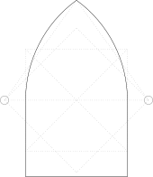
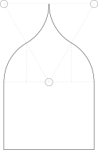
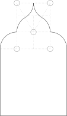
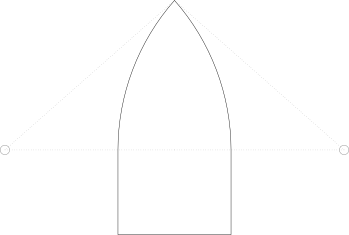

# constructions

Seven initial constructions from [*Guide to the Construction of Gothic Details* by F. Roesling (1888)](https://archive.org/details/guidetoconstruct00rose/page/n1/mode/2up) in standalone `tikz`. Requires `xelatex` and [`pdf2svg`](https://github.com/dawbarton/pdf2svg) to build SVG targets.

# Preface

> In submitting to the building profession this compilation of "gothic details," the author desires to supply a long felt want, so that not alone architects, builders and draughtsmen, but also beginners and artisans in general can study the fundamental rules of the gothic style without much loss of time.
>
> A rule of construction for every detail is given, which permits no modification of geometrical lines, for the historical value of this style strictly forbids any deviation from the geometrically and mathematically correct lines.
>
> It requires only a brief study of the accompanying details of the gothic style to make various designs in a manner identical with that employed by our ancestors; and while many structures have been put up in the spirit of our present time, it is frequently necessary to apply such details which unite beauty, economy, as well as comfort, and every architect, builder and draughtsman, in enlarging or reducing forms of structures erected in former times, should not destroy the general character of such buildings, but should strictly adhere to the established rules of the gothic style.
> 
> The details of construction herein given, it must be understood, are the productions of the genius of our ancestores, and they are herein reproduced, especially for enlarging or reducing the proportions, without running the risk of losing the design or time in construing or carrying out the details.
