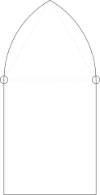
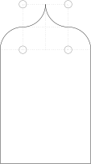
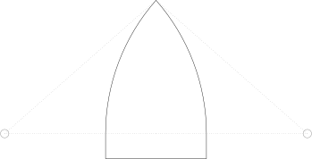

# constructions

Seven initial constructions from [*Guide to the Construction of Gothic Details* by F. Roesling (1888)](https://archive.org/details/guidetoconstruct00rose/page/n1/mode/2up) in standalone `tikz`.

Requires [`pdf2svg`](https://github.com/dawbarton/pdf2svg) to build SVG targets.

